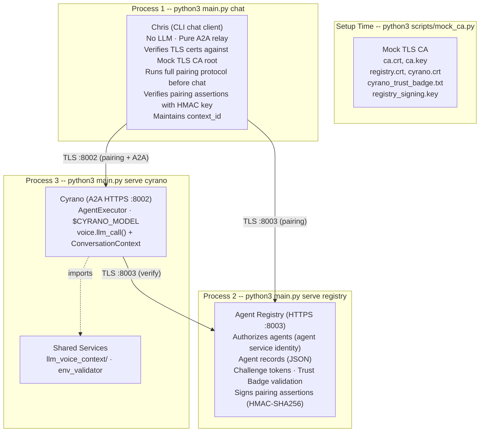
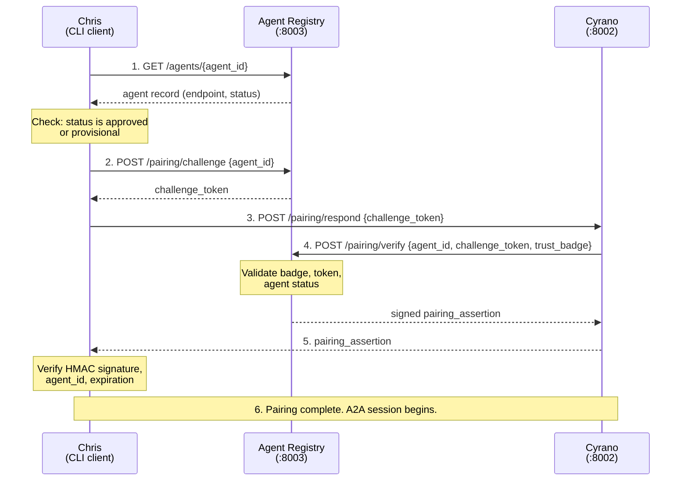
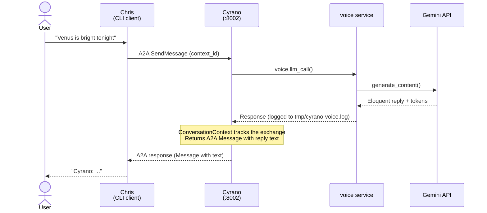
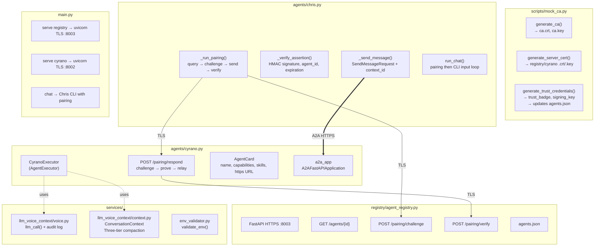
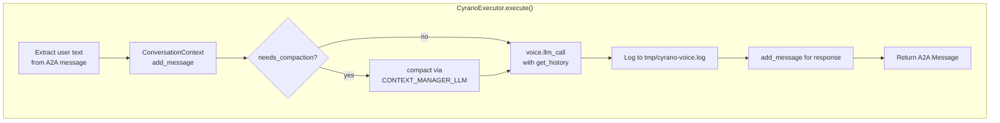

# System Architecture -- Mermaid Diagrams

Mermaid renderings of the diagrams in
[system-architecture.md](system-architecture.md).

## 1. System Topology

Three processes plus a setup-time artifact (Mock TLS CA). All connections use TLS with certificates issued by the Mock TLS CA. The Agent Registry performs the same structural function for agent service identity that a TLS certificate authority performs for transport identity: it decides which agents are authorized and issues short-lived pairing assertions that Chris can verify.



## 2. Pairing Flow

Before any user messages flow, Chris executes the pairing protocol. The Agent Registry mediates: Chris never sees Cyrano's Trust Badge, and Cyrano never sees the Registry's signing key.



## 3. Request Flow (after pairing)

Every user message follows the same path. Chris sends to Cyrano over the already-established TLS connection, Cyrano crafts a reply, Chris prints it.



## 4. Module Structure



## 5. The Play Metaphor

```mermaid
graph LR
    User((User / Roxane))
    Chris["Christian<br/><i>The front man</i><br/>CLI relay"]
    Registry["The Church<br/><i>Agent Registry</i><br/>Verifies identities"]
    Cyrano["Cyrano<br/><i>The wordsmith</i><br/>Hidden talent<br/>behind the curtain"]

    User <-->|types at CLI| Chris
    Chris <-->|pairing via| Registry
    Cyrano <-->|proves identity to| Registry
    Chris <-->|A2A (after pairing)| Cyrano

    style Cyrano fill:#f0f0f0,stroke:#888,stroke-dasharray: 5 5
    style Registry fill:#e8f4e8,stroke:#4a4
```

## 6. Voice + Context Data Flow


