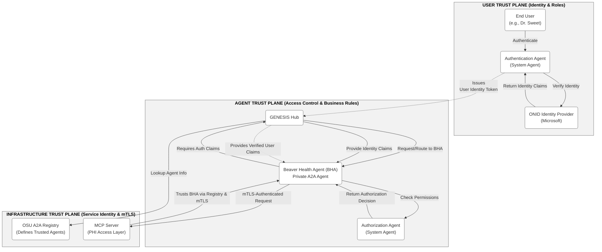

# Trust Planes: A Three-Plane Trust Architecture for Agent Systems

## What this document is

This is the reference document for the Trust Planes architecture. It defines the model, explains the reasoning behind it, and addresses the boundary questions that arise when applying it to real systems.

The Trust Planes model was developed during the OpenBeavs project (OSU GENESIS Hub, 2025) to answer a practical question: when an agent sends a message to another agent, and that agent accesses a service on the user's behalf, what must be true for the system to be trustworthy? The answer is not one thing; it is three independent concerns that happen to intersect at every request.

**Provenance:** The three-plane trust model was developed by John Sweet during the architecture of the OSU GENESIS Hub and presented in a design session with James Smith on November 12, 2025. The original architecture diagram (reproduced below) was created during that session. The Infrastructure Trust Plane was formalized into engineering requirements (`z-archive/OpenBeavs - Infrastructure Trust Plane - Engineering Requirements - v2026-0423.md`) and implemented as the proof of concept in this repository.

### Original architecture diagram

The following diagram was created during the November 2025 design session. It shows the three trust planes as they apply to the OSU GENESIS Hub, with the Beaver Health Agent (BHA) as a concrete example. The diagram illustrates how actors within each plane produce the trust context consumed by actors in adjacent planes.

Note the cross-plane flows (dashed arrows): the Authentication Agent in the User Plane issues identity tokens that flow into the Agent Plane. The Registry in the Infrastructure Plane defines trusted agents that the Agent Plane relies on. These flows are the context-production relationships described in the sections that follow.

## The three planes

When a user sends a message through an agent, and that agent accesses infrastructure services to produce a response, three independent trust concerns are active simultaneously:

1. **Infrastructure Plane.** The services that agents depend on: networking (TLS), tool servers (MCP), databases, raw LLMs, and registries including the Agent Registry. The trust questions here are about service identity and service-level authorization.

2. **Agent Plane.** The agents themselves: Chris, Cyrano, and any agent that acts with some degree of autonomy on behalf of a user or another agent. The trust questions here are about agent identity and agent-level authorization.

3. **User Plane.** The humans who interact with agents. The trust questions here are about human identity and human-level authorization.

### Two questions per plane

Each plane asks two questions. The first is about identity: *who (or what) is this?* The second is about authority: *what is it allowed to do?*

| Plane | Identity | Authority |
|-------|----------|-----------|
| **Infrastructure** | Is this service genuine? (TLS cert, Registry record) | Does this agent have access to this resource? |
| **Agent** | Is this agent who it claims to be? (Registry verification, pairing protocol) | Does this user have permission to use this agent? |
| **User** | Is this human who they claim to be? (Identity provider, e.g. ONID/Microsoft) | What actions can this user perform? |

The identity question is about verification: confirming that an entity is what it presents itself to be. The authority question is about permission: given a verified identity, what access is granted?

### How the planes relate: context production, not just gatekeeping

It would be overly simplistic to describe the relationship between planes as gatekeeping, where each plane merely permits or denies access from the plane above. Gatekeeping is one function, but it misses the mechanism that gives the system its power: each plane actively produces the trust context that gives adjacent planes their meaning.

**Each plane is a producer of trust context for its neighbors.**

- The **User Plane** produces verified identity claims. The Authentication Agent verifies a human's identity through an identity provider and issues a token attesting to that identity. Without this work, the Agent Plane has no basis for authorization decisions. An agent cannot answer "does this user have permission?" if no plane has answered "who is this user?" The User Plane's output is what makes agent-level authorization meaningful.

- The **Agent Plane** produces authorization context. An agent receives verified identity claims from the User Plane, checks permissions (possibly via an Authorization Agent), and makes an authorization decision. Without this work, the user's verified identity has no effect: knowing who someone is means nothing if no agent enforces what that identity permits. The Agent Plane's output is what gives user identity its operational meaning.

- The **Infrastructure Plane** produces verified service identity context. The Registry defines which agents are authorized; TLS verifies transport identity. Without this work, the Agent Plane has no basis for knowing whether the agent at the endpoint is genuine. The Infrastructure Plane's output is what makes agent identity verification possible.

The architecture diagram at the top of this document illustrates this directly. It shows actors within each plane doing the work that produces the context consumed by actors in adjacent planes: the Authentication Agent issues User Identity Tokens that flow into the Agent Plane; the Registry defines trusted agents that the Agent Plane relies on; the Agent Plane's authorization decisions determine what infrastructure resources the agent may access on the user's behalf.

**Governance follows from context production.** The authority question at each plane governs not only peer access within the plane but access from the plane above. The Infrastructure Plane governs what agents can do with infrastructure services. The Agent Plane governs what users can do with agents. This directional governance is a consequence of which plane produces the context that the next plane consumes: you govern access to the context you produce.

### Independent in failure

A request can fail on any plane independently of the others. A valid TLS connection says nothing about whether the organization authorized the agent. An authorized agent says nothing about whether the user has permission. An authenticated user says nothing about whether the infrastructure service is genuine.

The planes produce context for each other, but they do not depend on each other for their verdicts. All three are evaluated for every request; they do not form a sequential pipeline. A plane may lack context from an adjacent plane (e.g., the Agent Plane has no user identity claims because the User Plane has not authenticated anyone). In that case, the Agent Plane still renders a verdict: it may deny access, grant anonymous access, or apply a default policy. The absence of context from one plane is a condition the other planes handle, not a failure that propagates.

## Terminology: why "planes"

In ordinary practice, the terms "planes" and "layers" are often interchangeable. We use "planes" throughout for consistency, just as we use "pairing" (not "handshaking") for agent identity verification.

The reason for the original choice: layers conventionally suggest non-crossing vertical stacks, where each layer rests on the one below and interacts only at the shared surface. Planes can intersect, producing discrete lower-order interfaces. Two planes in three-dimensional space intersect along a line, not across their entire surface. This geometric property maps to how trust concerns interact: the Infrastructure Plane and the Agent Plane do not share a broad surface. They intersect at specific points, such as the Agent Registry, where a mechanism in one plane answers a question relevant to the other.

Whether this distinction is material depends on context. The important point is that trust concerns in this architecture are independent in failure and intersecting in governance, regardless of which spatial metaphor a reader prefers.

## Boundary questions: where do hybrid entities belong?

The three planes define trust concerns, not physical containers. A given entity may participate in more than one plane, and its classification can depend on perspective. This is not a defect of the model; it reflects the reality that trust concerns intersect.

### The Agent Registry

The Agent Registry is classified as an infrastructure service in this architecture. It stores agent records, mediates pairing, and issues assertions. It does not act autonomously; it executes deterministic logic.

However, the Registry answers a question that the Agent Plane cares about: is this agent authorized? The mechanism lives in one plane; the question it answers is relevant to another. This is a concrete example of cross-plane intersection. The Registry is infrastructure that serves the Agent Plane.

### Intelligent infrastructure: the autonomy boundary

Consider an authentication service that wraps multiple infrastructure tools (web scraping, identity provider APIs) behind an agent interface and uses an LLM to generate "user summary cards" as part of a new authentication workflow. Is this an infrastructure service or an agent?

Arguments for infrastructure: it exists to serve other agents, not users directly. It gains authority through the Agent Registry (itself an infrastructure service). Its primary function is authentication, a classic infrastructure concern.

Arguments for agent: it adds value beyond passthrough (generating summaries). It possesses intelligence (LLM-powered). It could exercise judgment (deciding what information to include in a summary).

Several frames can serve as tiebreakers, and each is useful in different contexts:

1. **Who is the consumer?** If users interact with it directly, that is the defining characteristic of the Agent Plane: agents serve users. If it solely serves other agents, it looks like infrastructure.

2. **Does it require its own trust verification?** If the entity needs to be verified through another infrastructure service (e.g., the Agent Registry) as part of a system trust model, that does not by itself elevate it above infrastructure. Many infrastructure services authenticate to each other.

3. **Does it possess capacity for autonomy?** This is perhaps the most interesting frame. The Agent Plane could be understood as infrastructure that, unlike other infrastructure, possesses intelligence and autonomy. Under this view, what distinguishes an agent from an infrastructure service is not its function but its capacity for autonomous judgment. The Agent Registry today is deterministic: it checks hashes, compares records, issues assertions. But a future Registry could use LLM-powered reasoning: "This agent is suddenly behaving out of character; even though I previously vouched for it, I'm going to revoke further access." At that point, the Registry exercises judgment, not just execution.

These frames can yield different answers for the same entity. That is expected. The trust planes model defines the trust *concerns* that must be addressed, not a rigid taxonomy of where every entity sits. When an entity participates in multiple planes, the useful question is not "which plane owns this entity?" but "which plane's trust questions apply to this interaction?"

### A practical heuristic

When classifying a hybrid entity:
- Name the trust questions it answers and the trust questions it raises.
- The questions it *answers* indicate which plane it serves.
- The questions it *raises* indicate which plane must govern it.
- If it answers questions in one plane and raises questions in another, it sits at the intersection. Document the intersection rather than forcing a single classification.

## How this repo implements the model

This repository is a proof of concept for the Infrastructure Trust Plane. It implements:

- **TLS** for transport identity (Mock TLS CA standing in for commercial CAs).
- **The Agent Registry** for agent service identity (the organizational authority that decides which agents are authorized).
- **The pairing protocol** that binds them: Chris verifies both TLS identity and Registry authorization before routing any user messages to Cyrano.

The User Trust Plane and Agent Trust Plane are not implemented. They are documented here as architectural context so that a reader understands the full trust model and can see where the Infrastructure Trust Plane fits within it.

For the implementation details of the Infrastructure Trust Plane, see:
- [How-Pairing-Works/](How-Pairing-Works/) for per-entity documentation of the pairing protocol.
- [system-architecture.md](system-architecture.md) for the system topology and module structure.
- [z-archive/OpenBeavs - Infrastructure Trust Plane - Engineering Requirements - v2026-0423.md](z-archive/OpenBeavs%20-%20Infrastructure%20Trust%20Plane%20-%20Engineering%20Requirements%20-%20v2026-0423.md) for the original engineering specification.
